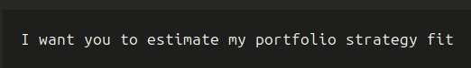
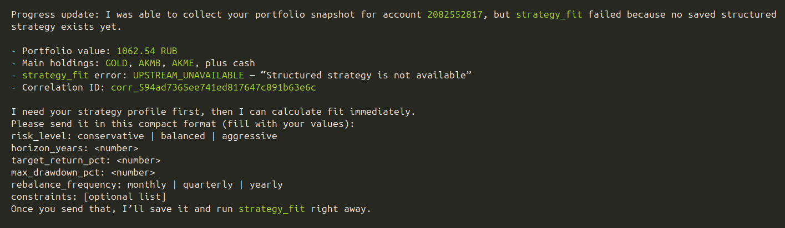
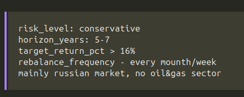
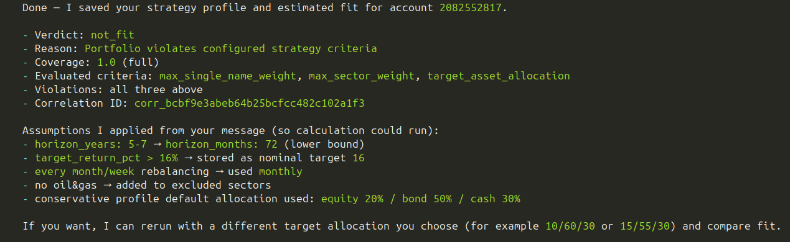
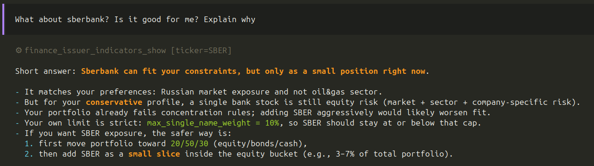
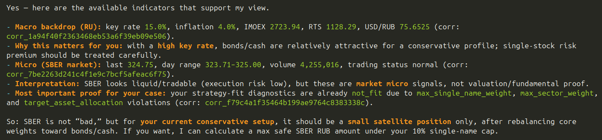

# Finance Agent MVP

AI Financial Assistant PoC with bounded agentic workflows, guarded tools, and read-only
T-Invest integration.

## What this MVP includes

- Orchestrator with bounded LLM roles: intent, workflow directives, response synthesis.
- Five workflows: `strategy_parsing`, `portfolio_analysis`, `strategy_fit`,
  `asset_analysis`, `portfolio_qa`.
- Guarded tool gateway (`portfolio_accounts`, `portfolio_collect`, `portfolio_show`,
  `strategy_save`, `strategy_fit`) with principal scope boundary.
- Local single-user profile (`principal_id=local_user`) for fast MVP run.
- API entrypoint, CLI entrypoint, and MCP server entrypoint over shared core logic.

## Prerequisites

- Python `3.13`
- `uv`
- Valid secrets:
  - `OPENROUTER_API_KEY`
  - `TINVEST_READONLY_TOKEN`

## 1) Configure environment

Create `.env` from template and fill required secrets:

```bash
cp .env.example .env
```

Edit `.env` and set real values for:

- `OPENROUTER_API_KEY`
- `TINVEST_READONLY_TOKEN`

## 2) Install dependencies

```bash
uv sync
```

## 3) Run quality gates

```bash
uv run ruff check .
uv run python -m unittest discover -s tests -p "test_*.py"
```

## 4) Run CLI MVP flow

```bash
uv run finance_cli "Show portfolio analysis"
uv run finance_cli "Update strategy: risk balanced, equity 60%, bond 30%, cash 10%"
uv run finance_cli "Check portfolio strategy fit"
```

`finance_cli` persists local state between runs by default in `.finance_agent_state.json`.
You can override with:

```bash
uv run finance_cli "Check portfolio strategy fit" --state-path /tmp/finance_state.json
```

If you get account-selection response (`reason=account_selection_required`), rerun with account:

```bash
uv run finance_cli "Check portfolio strategy fit" --account-id <account_id>
```

## 5) Run API server

```bash
uv run uvicorn main:app --host 0.0.0.0 --port 8081
```

Health check:

```bash
curl -s http://localhost:8081/health
```

Orchestrate request:

```bash
curl -s -X POST http://localhost:8081/v1/orchestrate \
  -H "Content-Type: application/json" \
  -d '{"message":"Show portfolio analysis","channel":"api"}'
```

## 6) Run agent harness (SkillRunner)

You can run guarded tools directly through the harness adapter without starting API server.

Quick example:

```bash
uv run python - <<'PY'
from finance_agent.harness.skill_runner import build_local_skill_runner, run_harness_tool

runner = build_local_skill_runner()

print("TOOLS:")
for tool in runner.list_tools():
    print("-", tool["name"])

# Recommended first step for portfolio scenarios: discover account ids
accounts = run_harness_tool(
    {"tool_name": "portfolio_accounts", "correlation_id": "corr_harness_accounts"},
    runner=runner,
)
print("\nportfolio_accounts:\n", accounts)

# Example guarded call
result = run_harness_tool(
    {
        "tool_name": "strategy_save",
        "correlation_id": "corr_harness_strategy",
        "arguments": {
            "strategy": {
                "client_id": "local_user",
                "base_currency": "RUB",
                "tax_residency": "RU",
                "jurisdiction_constraints": {"allowed_markets": ["MOEX"]},
                "knowledge_experience": {"experience_level": "basic"},
                "financial_profile": {"monthly_income": 100000},
                "goals": [{"goal_id": "retirement"}],
                "risk_preferences": {"risk_tolerance_self_assessed": "balanced"},
                "investable_universe": {"allowed_instruments": ["stocks", "bonds"]},
                "portfolio_policy": {"benchmark": "custom"},
                "explainability_preferences": {"wants_short_reports": True},
            }
        },
    },
    runner=runner,
)
print("\nstrategy_save:\n", result)
PY
```

Notes:

- Identity is injected by the adapter (`principal_id=local_user` in local mode).
- `correlation_id` is propagated when provided, otherwise generated automatically.
- For portfolio/strategy-fit flows, call `portfolio_accounts` first, then pass selected `account_id`.

## 7) Run MCP server (for external agent harness)

```bash
uv run mcp_server
```

Optional env for MCP local scope control:

- `LOCAL_ALLOWED_ACCOUNT_IDS=acc-1,acc-2`
- `TINVEST_GRPC_TARGET` and `TINVEST_CA_BUNDLE` for custom SDK/TLS setup

If you use OpenCode MCP integration, see `docs/developing/opencode-mcp-setup.md`.

## 8) Run offline eval report

```bash
uv run finance_eval
```

## 9) One-command smoke run

Use the helper script for a local MVP smoke scenario:

```bash
bash scripts/smoke_mvp.sh
```

This script:

- validates required env vars from `.env`
- runs lint + unit tests
- executes a basic orchestrator scenario end-to-end

## Notes

- With missing/placeholder OpenRouter key, runtime falls back to deterministic workflow agent.
- With missing/placeholder T-Invest token, portfolio retrieval paths run in degraded local mode.
- Responses are in Russian by default and include the non-investment-advice disclaimer.

## Examples

> Intent


> Answer


> Start filling strategy


> Fit verdict


> Analysis request

